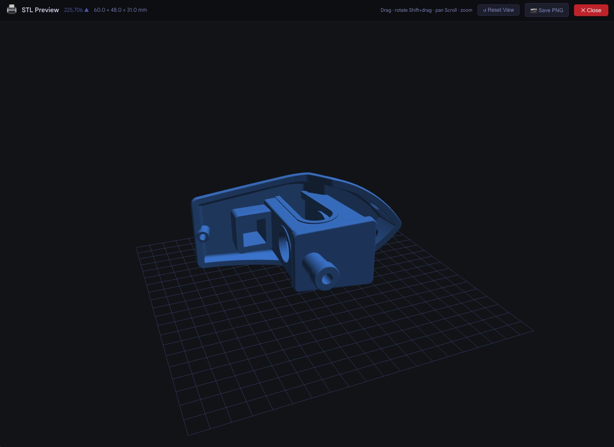

# STL Viewer for Google Classroom


Preview student STL files directly in Google Classroom without downloading them. Built for Tech Ed teachers running 3D printing units with Tinkercad.

When a student submits an STL file and Google Classroom shows "No preview available," this extension adds a **View in 3D** button. Click it to open a full-screen interactive 3D viewer — rotate, zoom, and check for floating geometry before sending anything to a printer.



---

## Features

- **Instant 3D preview** — no downloading, no opening Tinkercad, no slicer
- **Grid floor** — makes it immediately obvious if any part of the model is floating above the print bed
- **Floating geometry detection** — automatic ⚠️ warning when disconnected mesh components are found
- **Model dimensions** — shows W × D × H in mm in print orientation so you can check if it fits your printer
- **Auto-orient** — detects which way the model was exported and rotates it flat automatically
- **Reset View button** — one click to get back to the default angle
- **Nothing stored** — the file loads into memory for rendering only, never touches disk

---

## Install (Developer Mode)

The extension is not yet on the Chrome Web Store. In the meantime, you can install it manually in about two minutes.

### Step 1 — Get the files

Download the latest `stl-viewer-extension.zip` from the [Releases](../../releases) page and unzip it. You should have a folder called `stl-viewer-extension` containing `manifest.json`, `content.js`, `background.js`, and an `icons` folder.

### Step 2 — Open Chrome Extensions

In Chrome, go to:

```
chrome://extensions
```

### Step 3 — Enable Developer Mode

In the top-right corner of the Extensions page, toggle **Developer mode** on.

### Step 4 — Load the extension

Click **Load unpacked**, then select the `stl-viewer-extension` folder you unzipped in Step 1.

The extension will appear in your list as **STL Viewer for Google Classroom**. You can pin it to your toolbar by clicking the puzzle piece icon and pinning it.

### Step 5 — Try it

Open a Google Classroom assignment where a student has submitted an STL file. You should see a **🖨️ View in 3D** button appear below the "No preview available" box.

---

## Usage

| Control | Action |
|---|---|
| Drag | Rotate |
| Shift + drag | Pan |
| Scroll | Zoom in / out |
| ↺ Reset View | Return to default angle |
| ✕ Close | Close the viewer |

**Reading the toolbar:**

```
🖨️  STL Preview   6,592 ▲   60.2 × 30.1 × 5.0 mm   ⚠️ Floating geometry detected
```

- Triangle count tells you roughly how complex the model is
- Dimensions are Width × Depth × Height in the print orientation (H = thickness)
- The orange warning badge only appears when the detector finds geometry that isn't connected to the print bed

---

## Updating

Because this is an unpacked extension, Chrome Sync will not push updates to your other computers automatically. To update:

1. Download the new zip from Releases
2. Unzip and replace your existing folder
3. Go to `chrome://extensions` and click the **↺** refresh icon on the extension card

---

## Privacy

This extension does not collect, store, or transmit any data.

When you click View in 3D, the STL file is fetched from Google Drive into browser memory using your existing Google session. It is parsed and rendered on your GPU, then released when you close the viewer. Nothing is written to disk. No analytics, no tracking, no external servers.

---

## For IT Administrators

The extension requires these host permissions to fetch files from Google Drive using the teacher's existing authenticated session:

- `https://classroom.google.com/*`
- `https://drive.google.com/*`
- `https://docs.google.com/*`
- `https://*.google.com/*`
- `https://*.googleapis.com/*`
- `https://*.googleusercontent.com/*`

To deploy to managed Chromebooks or school Chrome profiles without requiring developer mode, contact your Google Workspace admin about pushing extensions via the Admin Console. The extension can be deployed by Extension ID once it is published to the Chrome Web Store.

---

## Roadmap

- [ ] Chrome Web Store listing (Maker404 publisher)
- [ ] Proper icon set
- [ ] Touch and stylus support
- [ ] Configurable printer bed size for the dimension check
- [ ] Color-code model height by Z layer (useful for checking wall thickness)

---

## About

Built by [Maker404](https://maker404.com) — free tools for K-12 makers and tech educators.

Questions or issues: open a GitHub issue or reach out via maker404.com.
